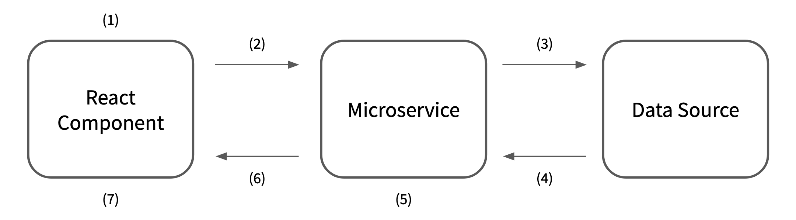
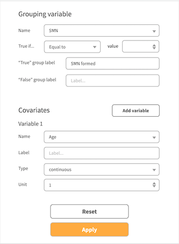

# PCDC Table One Requirements

This living document serves as a reference point for the requirements for designing and implementing Table One tool.

## Overview

> NOTE: The Table One tool's overall design is nearly identical to that of the Survival Analysis tool. Refer to [the requirements document](../survival-analysis-tool/requirements.md) for the Survial Analysis tool for comparison purposes.

### Architecture

The Table One tool can be seen as a combination of the following elements:

- React Component
  - A UI component that 1) allows users to provide input, 2) sends HTTP request to Microservice with the user input, 3) fetches the response JSON data from Microservice, and 4) generates/updates the table using the fetched data.
  - React Component consists of three UI child components: 1) a user input form, and 2) a table output.
- Microservice
  - A newly created web service that 1) listens to HTTP requests with user input as a payload, 2) fetches the data from Data Source with the filters, 3) generate table data using the fetched data with the grouping variable/covariates, and 4) serve the table data to the client as the payload for HTTP response.
  - Microservice will be implemented as an endpoint of [`PcdcAnalysisTools`](https://github.com/chicagopcdc/PcdcAnalysisTools) service.
- Data Source
  - A database or an intermediary service that responds to database queries.

### Workflow

The following diagram demonstrates the expected task workflow of the survival analysis tool:



1. User input is provided, triggering Step 2
2. React Component sends HTTP request to Microservice with the user input as a payload
3. Microservice constructs data query based on user input and sends it to Data Source
4. Data Source sends query result to Microservice
5. Microservice creates table one data with the user input and the fetched query result, and packages the output as a JSON object
6. Microservice sends HTTP response to React Component with table data in JSON as a payload
7. React Component generates/updates table using the fetched output

## React Component

Table One tool's React Component will be part of the `<GuppyDataExplorer>` component of PCDC's Gen3 data portal.

`<GuppyDataExplorer>` includes two child components, `<ExplorerFilter>` and `<ExplorerVisualizations>`, and the Table One React Component will be part of `<ExplorerVisualizations>`. More specifically, React Component will be implemented so that it is one of the tabs ("Table One" table) on `<ExplorerVisualizations>`.

### Features

The following features and functionalities are required of React Component:

- Access to the filter values set by users via `<ExplorerFilter>` UI
- A child component to encode user input for "grouping variable" and "covariates".
  - the component must accept a prop for the variables data derived from filter values and use it to dynamically generate input fields and their values; see [User input prop](#user-input-form-prop) section below.
  - input fields for "grouping variable" should allow the user to 1) select a variable, 2) choose "true" condition (specific category or range of values)
  - input fields for "covariates" should allow the user to add variables to use as well as for each variable to 1) choose type (categorical, bucketized, continuous), 2) set of values (categorical) or cutoff values (bucketized), and 3) (optional) labels for each category or bucket.
- A child component to display table output

#### User input form example



#### User input form prop

> ⚠️ User input form prop shape is currently not stable.

User input form takes a prop of the following shape:

```js
{
  variables: [
    {
      name: "",
      label: "",
      isGrouping: true,
      type: "", // "categorical" | "continous" 
      values: [], // for "categorical" variable only
      range: [] // for "continuous" variable only
    }
  ]
}
```

- `variables` is an array of variable object with the following properties:
  - `name` is the name of the given variable
  - `label` is the displayed label for the variable
  - `isGrouping` is Boolean flag for whether the variable is a candidate for grouping variable or not (i.e. covariate)
  - `type` is either `categorical` or `continuous`
  - `values` is an array of possible values for the categorical variable, where each value is string
  - `range` is tuple of `min` and `max` values for the continous variable, where `min` and `max` are numbers


### Notes on dependencies

For user input form, using vanila JSX elements (`<form>`, `<input>`, `<select>`, etc.) is strongly recommended for the prototpye/proof-of-concept application. For integrating into the `chicaopcdc/data-portal` codebase, consider replacing `<select>` with [React Select](https://react-select.com/) to match select elements in other parts of the codebase.

For building the table, using vanila JSX elements (`<table>`, `<thead>`, `<tbody>`, etc.) is recommended since the output is a simple, static HTML table. Using [React Table](https://react-table.tanstack.com/) is also acceptable as it is an existing dependency. However, introducing any new NPM package to build the table is strongly discouraged.

## Microservice

Table One tool's Microservice is a new endpoint for the [`PcdcAnalysisTools`](https://github.com/chicagopcdc/PcdcAnalysisTools) service added to the Gen3 infrastructure and responsible for generating table data from project data fetched from Data Source according to the user input provided by React Component.

The work of generating table data includes:

1. Aggregating counts for each covariate
2. Calculating means or frequencies for each covariate

### Request API

> :warning: Request API is currently not stable.

Microservice listens to POST request with the payload in JSON of the following shape:

```jsonc
{
  "patientSearchCriteria": {
    // as constructed by <ExplorerFilter>
    "query": "",
    "variables": {
      "filter": {
        // ...
      }
    }
  },
  "groupingVariable": {
    "name": "",
    "trueIf": {
      "value": "",
      "operator": "" // "eq" | "gt" | "gte" | "lt" | "lte"
    },
    "label": {
      "true": "",
      "false": ""
    }
  },
  "covariates": [
    {
      "name": "",
      "label": "",
      "type": "", // "categorical" | "bucketized" | "continous"
      "unit": 1, // for bucketized or continuous variable only
      "cutoffs": [], // for bucketized variable only
      "values": [], // for categorical variable only
      "keys": [] // optional; for bucketized or categorical variable only
    }
  ]
}
```

- `groupingVariable` is a top-level factor used for dividing data into groups
  - `trueIf` specifies the binary grouping criteria
    - `operator` is set to `"eq"` by default
    - Other `operator` values are available only for continuous variables
- `covariates` is an array of the secondary factors
  - `unit` is a number to consider the "unit" value for visual presentation and cutoffs
  - `values` are set for categorical variables only
  - `cutoffs` are set for continuous variables only; resulting bins are inclusive at the lower end and exclusive at the upper end
  - `keys` are optional; if not provided, will be generated automatically based on `values` for a categorical variable or `cutoffs` for a continuous variable

#### Discussions

- Should we allow using "range" for `groupingVariable.trueIf`?
  - This can be achieved by accepting an array for `groupingVariable.trueIf.value` value and adding `"in"` option for `groupingVariable.trueIf.operator`, to signal that the "trueIf" condition is a range of values.
  - When using `groupingVariable.trueIf.operator: "in"`, the value for `groupingVariable.type` will be used to indicate how to parse the `groupingVariable.trueIf.value` value:
    - if `"continuous"`, the array will look like `[min, max]`
    - otherwise, the array will include a set of values to consider "true"
  - If this option is to be implemented, it may be a good idea to rename `groupingVariable.trueIf.value` (singular) to `groupingVariable.trueIf.values` (plural)

### Response API

> :warning: Request API is currently not stable.

Microservice sends response with data in JSON of the following shape:

```jsonc
{
  "headers": {
    "size": "",
    "true": "",
    "false": ""
  },
  "variables": [
    {
      "name": "",
      "size": {
        "total": 0,
        "true": 0
      },
      "keys": [
        {
          "name": "", // if empty, data is displayed on the same row
          "data": {
            "true": 0.0,
            "false": 0.0
          }
        }
      ]
    }
  ]
}
```

- `headers` is an array of names for table columns (string)
  - `size` is the column header for presenting total sample size as well as the "true" group size in parentheses.
  - `true` is the column header for presenting values for "true" group that satisfies the `trueIf` condition (see Request API); `false` is the column header for presenting values for "false" group
- `variables` contains data for the table body where each element includes information on specific `covariate`
  - `size.total` is the total sample size; `size.true` is the sample size for the "true" group for `groupingVariable`
  - `keys` contains data for specific value for `covariate`
    - if `name` is empty, data is displayed on the same row as the rest of `covariate`; otherwise, each "key" will get its own row

### Notes on dependencies

For handling/wrangling data, use `pandas` and `numpy`, which are also existing dependencies.

## Limitations and expectations

- The current API design restricts `groupingVariable` to be binary. While it is possible, relaxing this restriction and allow multiple top-level groups, i.e. `groupingVariable` values, is currently out of scope.

## Example

### User input

User-provided values are shown in `monospace`.

- Grouping variable:
  - Name: `"SMN"`
  - True if:
    - Value: `1`
    - Operator: `"equal to"`
  - Label for:
    - "True" group: `"SMN Formed"`
    - "False" group: `"No SMN Formed"`
- Covariates:
  - Variable 1:
    - Name: `"AGE"`
    - Label: `"Mean age at diagnosis (mo)"`
    - Type: `"continuous"`
    - Unit: `30`
  - Variable 2:
    - Name: `"AGE"`
    - Label: `"Age at diagnosis"`
    - Type: `"bucketized"`
    - Cutoffs:
      - Value: `18`
    - Keys:
      - Value: `"< 18 mo"`
      - Value: `">= 18 mo"`
  - Variable 3:
    - Name: `"SEX"`
    - Label: `"Sex"`
    - Type: `"categorical"`
    - Values:
      - Value: `0`
      - Value: `1`
    - Keys:
      - Value: `"Female"`
      - Value: `"Male"`

### Request body

From React Component to Microservice

```json
{
  "patientSearchCriteria": {},
  "groupingVariable": {
    "name": "SMN",
    "trueIf": {
      "value": "1",
      "operator": "eq"
    },
    "label": {
      "true": "SMN Formed",
      "false": "No SMN Formed"
    }
  },
  "covariates": [
    {
      "name": "AGE",
      "label": "Mean age at diagnosis (mo)",
      "type": "continous",
      "unit": 30
    },
    {
      "name": "AGE",
      "label": "Age at diagnosis",
      "type": "bucketized",
      "unit": 30,
      "cutoffs": [18],
      "keys": ["< 18 mo", ">= 18 mo"]
    },
    {
      "name": "SEX",
      "label": "Sex",
      "type": "categorical",
      "values": [0, 1],
      "keys": ["Female", "Male"]
    }
  ]
}
```

### Response data

From Microservice to React Component.

```jsonc
{
  "headers": {
    "size": "Sample size (SMN)",
    "true": "SMN Formed",
    "false": "No SMN Formed"
  },
  "variables": [
    {
      "name": "Mean age at diagnosis (mo)",
      "size": {
        "total": 5987,
        "true": 43
      },
      "keys": [
        {
          "name": "",
          "data": {
            "true": 27.5,
            "false": 18.0
          }
        }
      ]
    },
    {
      "name": "Age at diagnosis",
      "size": {
        "total": 5987,
        "true": 43
      },
      "keys": [
        {
          "name": "< 18 mo",
          "data": {
            "true": 41.9,
            "false": 50.0
          }
        },
        {
          "name": ">= 18 mo",
          "data": {
            "true": 58.1,
            "false": 50.0
          }
        }
      ]
    },
    {
      "name": "Sex",
      "size": {
        "total": 5987,
        "true": 43
      },
      "keys": [
        {
          "name": "Female",
          "data": {
            "true": 62.8,
            "false": 46.6
          }
        },
        {
          "name": "Male",
          "data": {
            "true": 37.2,
            "false": 53.4
          }
        }
      ]
    }
  ]
}
```

### Resulting table

Rendered by React Component.

|                                | Sample size (SMN) | SMN Formed | No SMN Formed |
| ------------------------------ | ----------------- | ---------- | ------------- |
| **Mean age at diagnosis (mo)** | 5987 (43)         | 27.5       | 18.0          |
| **Age at diagnosis**           | 5987 (43)         |            |               |
| < 18 mo                        |                   | 41.9       | 50            |
| >= 18 mo                       |                   | 58.1       | 50            |
| **Sex**                        | 5987 (43)         |            |               |
| Female                         |                   | 62.8       | 46.6          |
| Male                           |                   | 37.2       | 53.4          |

## References

- Survival Analysis tool
  - As noted above, the current tool shares a lot of elements with Survival Analysis tool
  - Proof-of-concept for React Component ([GitHub](https://github.com/bobaekang/poc-survival-react-component))
  - Proof-of-concept for Microservice ([GitHub](https://github.com/bobaekang/poc-survival-microservice))
- Microservice work-in-progress repository ([GitHub](https://github.com/chicagopcdc/PcdcAnalysisTools))
  - Using [sheepdog](https://github.com/uc-cdis/sheepdog/) codebase as a template
  - Repo currently private
